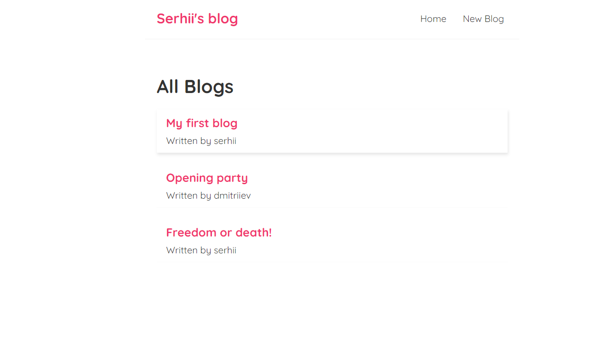
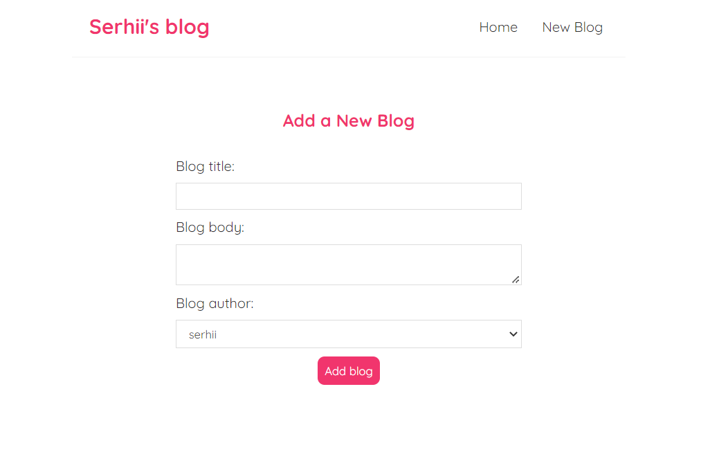
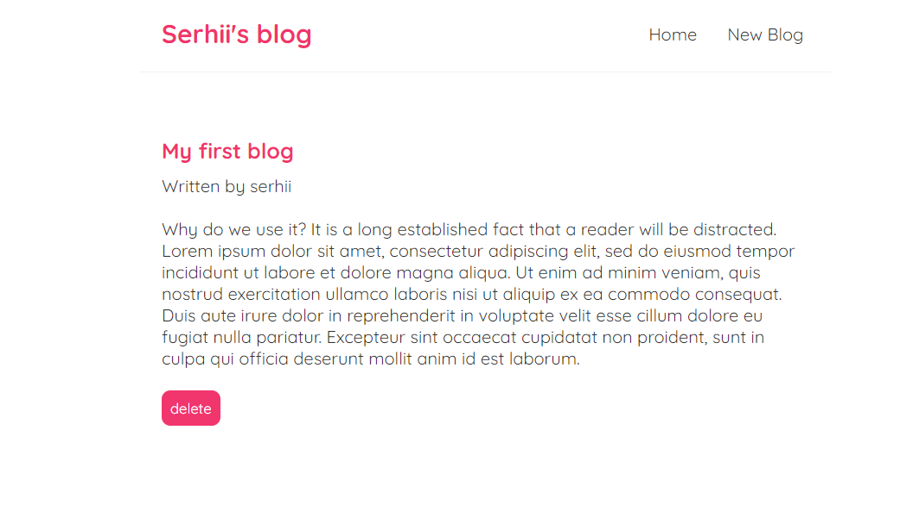

# blog
## <a id="header"></a> Blog


## AIM OF THE PROJECT

### I mastered:

- [x] React Router v5
  - [x] BrowserRouter;
  - [x] Route;
  - [x] Switch;
  - [x] Link;
  - [x] useHistory hook;
- [x] fetching data from json file using the json server;
- [x] making a POST request;
- [x] making a custom hook;
- [x] useEffect and useEffect cleanup function;
- [x] Programmatic redirects;

### INSTRUCTIONS FOR BUILDING AND RUNNING THE PROJECT

1. Download the project
2. As the project uses json.file, you will need to install the global json server

```
npm install -g json-server
```

3.Create end points

```
json-server ./data/db.json --port 8000
```

### SCREENSHOTS





## STRUCTURE OF THE PROJECT

This project consists of a root component `App.js` which contains several components with their css styles. You can write your blog, save it, and delete it.

Go up to the [Header](#header) !
